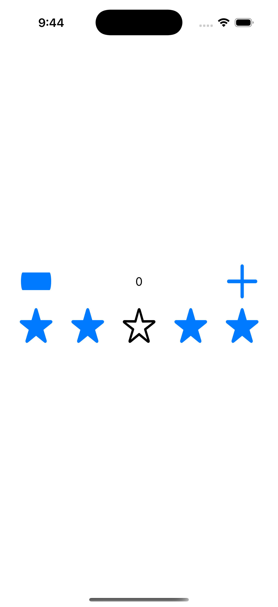

# swift-navigation-test

This project is created to showcase an edgecase for swift-navigation, that I got into while experimenting with UI approach to App design system, I briefly recreated the structure of the project to reproduce the issue.



- Black star button uses custom binding, that was acheived with internal `swift-navigation` functions accessed via `@testable` imports, experimental observation is enabled if the star is filled
- You can use `+` and `-` buttons to control counter value


**The issue:**

> `observe` function provided by the library is not suitable for nested observable models
>
> - When child model is updated in parent model observation is triggered
>
> - When observation is triggered I bind child model to parent model
>
> - Since binding involves observation, child props become tracked by the parent
>
> - It triggeres redundant parent updates when child props change
>   - _You can try updating counter with black star filled and stroked and you'll notice that with the basic `swift-navigation` observe functions (stroked star) UI glitches and there are a bunch of logs in the console_
>

I think that if I perform binding in smth like `DispatchQueue.main.async` to get out of the tracking context it should work fine, however jumping away in this manner feels off 🌚

So I tried to use some internal APIs to solve the issue and setup tracking separately from updates (see [Observe.swift](./swift-navigation-test/PrivateAPIs/Observe.swift) and any of `+Component.swift` files)

> Yeah, using `@testable import` in production doesn't feel off 🗿 _(it's a joke)_

I tried to keep it as simple as possible for the example, but I managed to improve the API for derived tracking in the main project with some helper functions

```swift
updateBindings([
  model.observe(\.icon, onChange: assign(to: \.content.image)),
  model.observe(\.style, onChange: assign(to: \.content.style)),
  model.observe(\.action, onChange: assign(to: \.action)),
])
```

**But there is a different problem:**

> `observe` only wraps tracking block in animation (or rather applies transaction keys' perform function in tracking context instead of `onChange`)

It can be caught by setting breakpoints for tint updates in [IconButton+Component.swift](./swift-navigation-test/UIComponents/IconButton/IconButton+Component.swift) (_it doesn't gets animated anyway, but it's ok, the only thing that matters here is a call stack_)


----

So now I'm not sure about further experiments definetely don't want to depend on my own fork since I'll have depend on TCA fork and maybe some others, so I see creating a PR to `swift-navigation` as a potential solution for the lib to provide an API for selective tracking and derived updates.

Core implementation would be smth like this (+ providing `observe` overload for such calls)

```swift
private func onChange(
  of tracking: @escaping @Sendable (_ transaction: UITransaction) -> Void,
  perform action: @escaping @Sendable (_ transaction: UITransaction) -> Void,
  task: @escaping @Sendable (
    _ transaction: UITransaction, _ operation: @escaping @Sendable () -> Void
  ) -> Void
) {
  // I guess it's better to call it before
  // tracking setup to avoid redundant updates
  // if apply has some state-mutating logic
  action(.current)
  
  withPerceptionTracking {
    // not sure if tracking block needs transaction
    tracking(.current)
  } onChange: {
    task(.current) {
      onChange(of: tracking, perform: action, task: task)
    }
  }
}
```

Definetely won't use `@testable import`'s 😅 

Local solution could be to locally create a wrapper with `DispatchQueue.main.async` to extract updates from the tracking context without using internal APIs 🤔

smth like

```swift
@MainActor
extension NSObject {
	public func observe(
		_ tracking: @escaping @MainActor @Sendable (UITransaction) -> Void,
		onChange: @escaping @MainActor @Sendable (UITransaction) -> Void
	) -> ObserveToken {
		observe { transaction in
			tracking(transaction)
      
      // escape from tracking context
			DispatchQueue.main.async {
        // keep the transaction
				withUITransaction(transaction) {
					onChange(transaction)
				}
			}
		}
	}
}
```